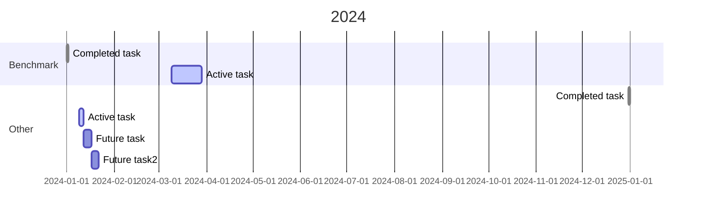
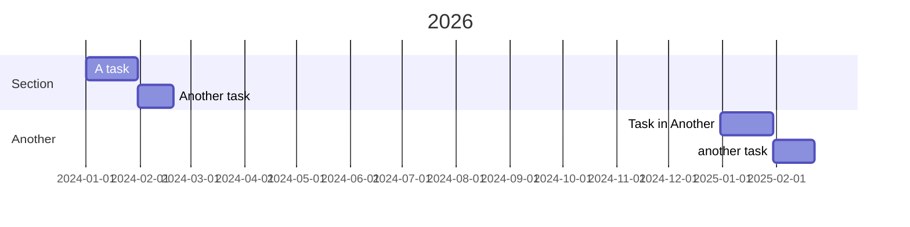

```mermaid

gantt
title 2024
dateFormat YYYY-MM-DD
section Benchmark
    Completed task            :done,    des1, 2024-01-01, 1d
    Active task               :active,  des2, 2024-03-09, 20d


section Other
    Completed task            :done,    des1, 2024-12-31, 1d
    Active task               :active,  des2, 2024-01-09, 3d
    Future task               :         des3, after des2, 5d
    Future task2              :         des4, after des3, 5d

```

```mermaid
gantt
title 2025
dateFormat YYYY-MM-DD
section Section
    A task          :a1, 2024-01-01, 30d
    Another task    :after a1, 20d
section Another
    Task in Another :2024-12-31, 30d
    another task    :24d
```

```mermaid
gantt
title 2026
dateFormat YYYY-MM-DD
section Section
    A task          :a1, 2024-01-01, 30d
    Another task    :after a1, 20d
section Another
    Task in Another :2024-12-31, 30d
    another task    :24d

```
